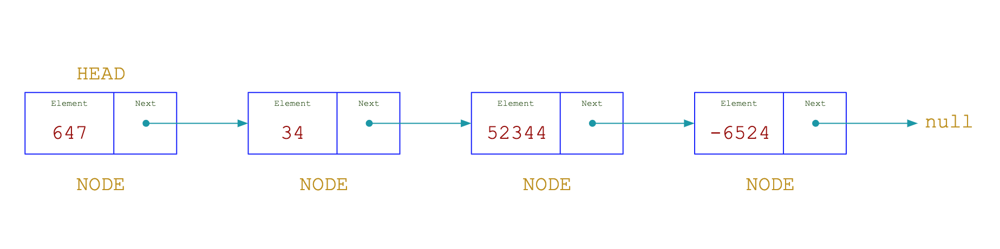

# Data Structures

JavaScript Data Structure written in TypeScript

## Summary

<!-- TOC -->

- [Data Structures](#data-structures)
  - [Summary](#summary)
  - [Installation and Usage](#installation-and-usage)
    - [Server-side:](#server-side)
      - [Typescript](#typescript)
  - [Documentation](#documentation)
    - [Linked List](#linked-list)
      - [Initializer](#initializer)
      - [Methods](#methods)
        - [addToLast](#addtolast)
          - [Parameters](#parameters)
          - [Description](#description)
        - [addToHead](#addtohead)
          - [Parameters](#parameters)
          - [Description](#description)
        - [addElementAtPosition](#addelementatposition)
          - [Parameters](#parameters)
          - [Description](#description)
        - [removeFromLast](#removefromlast)
          - [Description](#description)
        - [removeFromHead](#removefromhead)
          - [Description](#description)
        - [removeFirstElementFoundFromList](#removefirstelementfoundfromlist)
          - [Parameters](#parameters)
          - [Description](#description)
        - [removeAllElementsFromList](#removeallelementsfromlist)
          - [Parameters](#parameters)
          - [Description](#description)
        - [reverse](#reverse)
          - [Description](#description)
        - [fromArray](#fromarray)
          - [Parameters](#parameters)
          - [Description](#description)
        - [toArray](#toarray)
          - [Description](#description)
        - [getLength](#getlength)
          - [Description](#description)
        - [isEmpty](#isempty)
          - [Returns](#returns)
          - [Description](#description)
        - [print](#print)
          - [Description](#description)
  - [License](#license)

<!-- /TOC -->

## Installation and Usage

### Server-side:

Using [npm](http://www.npmjs.org):

```bash
npm install sb-ds-data-structures
```

Then where needed:

#### Typescript

```typescript
import { LinkedList } from 'sb-js-data-structures'

const list = new LinkedList()

list.addToLast(1)
list.addToLast(2)
```

## Documentation

### Linked List

Creates a Linked List, a data structure where each element is a separate object and the elements are linked using pointers.



#### Initializer

```typescript
import { LinkedList } from 'sb-js-data-structures'

const list = new LinkedList()
```

#### Methods

##### addToLast

```typescript
public addToLast(element: T): void
```

###### Parameters

- **element** `T` - The element to be inserted

###### Description

Insert an element to the ending of the Linked List.

##### addToHead

```typescript
public addToHead(element: T): void
```

###### Parameters

- **element** `T` - The element to be inserted

###### Description

Insert an element to the beginning of the Linked List.

##### addElementAtPosition

```typescript
public addElementAtPosition(element: T, position: number): void
```

###### Parameters

- **element** `T` - The element to be inserted
- **position** `number` - position where the element should be inserted

###### Description

Insert an element to a specific position of the Linked List, since `position` is less then the number of elements of the Linked List.

##### removeFromLast

```typescript
public removeFromLast(): void
```

###### Description

Remove the element on the ending of the Linked List.

##### removeFromHead

```typescript
public removeFromHead(): void
```

###### Description

Remove the element on the beginning of the Linked List.

##### removeFirstElementFoundFromList

```typescript
public removeFirstElementFoundFromList(element: T): void
```

###### Parameters

- **element** `T` - The element to be removed

###### Description

Remove the first element found on the Linked List.

##### removeAllElementsFromList

```typescript
public removeAllElementsFromList(element: T): void
```

###### Parameters

- **element** `T` - The element to be removed

###### Description

Remove all the elements found on the Linked List.

##### reverse

```typescript
public reverse(): void
```

###### Description

Reverse the Linked List.

##### fromArray

```typescript
public fromArray(element: T[]): void
```

###### Parameters

- **elements** `T[]` - Array of elements

###### Description

Insert all the `elements` at the ending of the Linked List.

##### toArray

```typescript
public toArray(): T[]
```

###### Description

Create an array with all the elements of the Linked List.

##### getLength

```typescript
public getLength(): number
```

###### Description

Get the length of the Linked List.

##### isEmpty

```typescript
public isEmpty(): boolean
```

###### Returns

- **boolean** - Returns `true` if the Linked List has no elements, otherwise, returns `false`.

###### Description

Informs if the Linked List is empty.

##### print

```typescript
public isEmpty(): boolean
```

###### Description

Console log the Linked List elements.

## License

MIT
